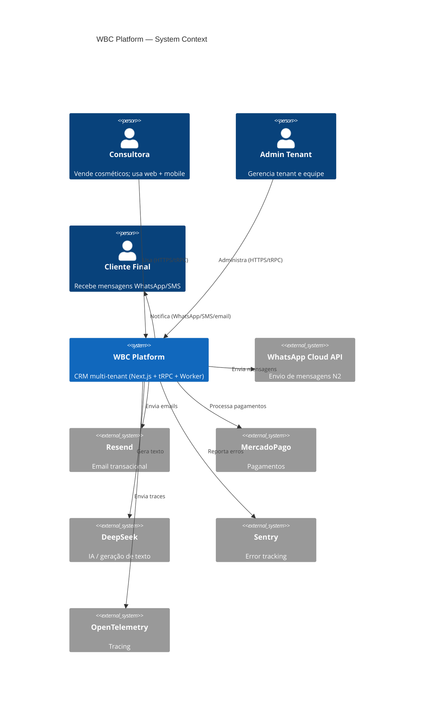
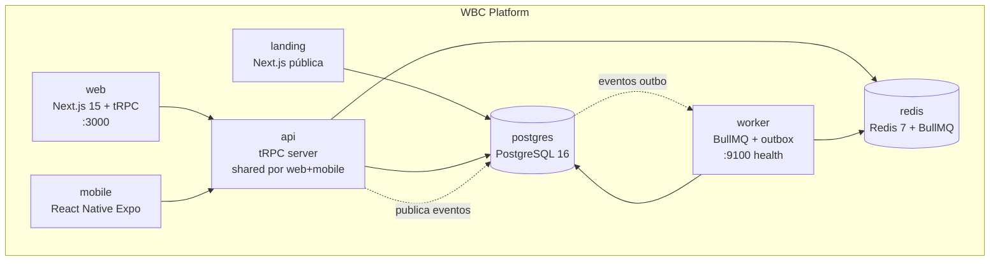

# WBC Platform — Arquitetura

> Visão consolidada da arquitetura. Criada pelo ACH-001 da auditoria de arquitetura (run `2026-04-18_18-17-50`).

## Overview (1 página)

**WBC Platform** (Wave Beauty Consultant) é um CRM vertical multi-tenant para consultoras de beleza no Brasil, da WeaveCode Ltd.

- **Stack:** TypeScript, Next.js 15, tRPC 11, Prisma, PostgreSQL, Redis, BullMQ, React Native Expo, Turborepo, pnpm workspaces.
- **Padrão arquitetural:** Hexagonal (Ports & Adapters) + DDD implícito — ADR-001.
- **Isolamento:** Multi-tenant com `tenantId` obrigatório em toda query Prisma — ADR-002.
- **Comunicação entre módulos:** exclusivamente por eventos assíncronos (outbox + BullMQ) — ADR-003.
- **Autenticação:** OTP-only via SMS/WhatsApp — ADR-004.
- **Monorepo:** Turborepo + pnpm workspaces — ADR-005.

## C4 Level 1 — System Context

## C4 Level 2 — Containers

## Apps (contêineres de execução)

Cada app em `apps/*` tem um propósito distinto e uma superfície de execução diferente. Os apps **compartilham código** via `packages/shared`, `packages/business`, `packages/db`, `packages/ui` (web) e `packages/ui-native` (mobile), mas não se comunicam entre si em runtime (proíbido por ADR-001).

| App            | Tecnologia                      | URL/Porta (prod)          | Responsabilidade                                                                                                                                                                                                      |
| -------------- | ------------------------------- | ------------------------- | --------------------------------------------------------------------------------------------------------------------------------------------------------------------------------------------------------------------- |
| `apps/web`     | Next.js 15 App Router + tRPC 11 | `https://<dominio>` :3000 | Interface da consultora. **Hospeda o tRPC server** (dev + prod). Autentica via next-auth (credentials + OTP). SSR + Client Components.                                                                                |
| `apps/api`     | tRPC standalone + OTEL          | `:4000` (interno)         | **Serviço dedicado de tRPC** usado como alvo futuro de isolamento (hoje apenas uma skeleton executável e alvo para testes de performance). Ver ADR-005 para roadmap de "api extraído".                                |
| `apps/worker`  | BullMQ + Prisma                 | `:9100` (health check)    | **Processa eventos de outbox** + jobs BullMQ. Único consumidor das filas `wbc:messaging`, `wbc:campaigns`, `wbc:schedule`, `wbc:analytics`, `wbc:dlq`. Shutdown gracioso de 40s (ACH-005 confiabilidade-resiliencia). |
| `apps/mobile`  | React Native Expo               | Store (iOS/Android)       | App da consultora. **Consome `apps/web` via tRPC** (mesmo servidor). Compartilha tipos via `@wbc/shared`.                                                                                                             |
| `apps/landing` | Next.js SSG                     | `https://<dominio>/`      | Site público de marketing. **Não toca Postgres em produção** — consome tRPC apenas para formulários de captação (rate-limited).                                                                                       |

### Regras de comunicação entre apps

- `web` → Postgres/Redis: OK (é o BFF).
- `mobile` → `web` via tRPC HTTPS: OK (autenticado).
- `landing` → `web` via tRPC HTTPS: OK apenas para endpoints marcados como `public` (captação).
- `worker` ↔ Postgres/Redis: OK (mesmo DB do `web`).
- `worker` → providers externos (WA/DeepSeek/Resend): OK.
- **Proíbido:** `worker` chamar tRPC do `web`; `web` chamar `worker` diretamente (usar outbox).

## Módulos de negócio (`packages/business/*`)

Todos os 15 módulos seguem o shape hexagonal (`domain/`, `ports/`, `adapters/`, `use-cases/`), com 1 exceção em análise (`ai/`, ADR-006 — skeleton de `domain/` criado; decisão final pendente).

| Módulo      | Responsabilidade core                     |
| ----------- | ----------------------------------------- |
| `auth`      | Autenticação OTP, sessão, entitlements    |
| `clients`   | CRUD de clientes, tags, classificação ABC |
| `sales`     | Vendas, cashback, pagamentos, returns     |
| `campaigns` | Campanhas promocionais                    |
| `catalog`   | Produtos, variações, preços               |
| `inventory` | Estoque, ajustes, reservas                |
| `finance`   | Financeiro, fechamento de período         |
| `logistics` | Entregas, tracking                        |
| `messaging` | WhatsApp N1/N2, templates, post-sale flow |
| `schedule`  | Agenda, lembretes, appointments           |
| `team`      | Equipe, papéis (owner/admin/consultor)    |
| `platform`  | Plans, features, billing do SaaS          |
| `analytics` | Dashboards, stats, engagement score, ABC  |
| `ai`        | Gateway para provider de IA (DeepSeek)    |
| `landing`   | Conteúdo público, captação                |

## Packages compartilhados

| Package      | Conteúdo                                                                                                                                             |
| ------------ | ---------------------------------------------------------------------------------------------------------------------------------------------------- |
| `db`         | Prisma schema, migrations, `PrismaOutboxRepository`, tenant middleware                                                                               |
| `shared`     | Types (tenant, common), eventos, `CircuitBreaker`, `resilience/` (RetryPolicy, TimeoutPolicy), `TenantScopedRedis`, tenant-context AsyncLocalStorage |
| `ui`         | Componentes shadcn/ui (web)                                                                                                                          |
| `ui-native`  | Componentes React Native (mobile)                                                                                                                    |
| `validators` | Schemas Zod compartilhados                                                                                                                           |
| `config`     | Constantes, env validation                                                                                                                           |
| `i18n`       | Traduções pt-BR, en                                                                                                                                  |

## Regras arquiteturais (enforced)

Via `dependency-cruiser` (ACH-007):

1. `domain/` nunca importa de `adapters/` ou `use-cases/`.
2. `use-cases/` importam apenas de `ports/`, não de `adapters/`.
3. `ports/` nunca importam de `adapters/`.
4. Módulos `business/X` nunca importam de `business/Y` — comunicação é por eventos.
5. Sem dependências circulares.

Script: `pnpm run arch:check` (rodar no CI).

## Mapa de dados (matriz resumida)

| Agregado                             | Dono (módulo) | Leitores principais           |
| ------------------------------------ | ------------- | ----------------------------- |
| `Client`                             | clients       | sales, analytics, messaging   |
| `Sale` + `SaleItem`                  | sales         | analytics, inventory, finance |
| `Cashback`                           | sales         | sales, analytics              |
| `Product`                            | catalog       | sales, inventory              |
| `InventoryAdjustment`                | inventory     | catalog, analytics            |
| `Appointment` + `Reminder`           | schedule      | messaging, analytics          |
| `Campaign`                           | campaigns     | messaging, analytics          |
| `OutboxEvent`                        | db (shared)   | worker                        |
| `TenantMember`, `Account`, `Session` | auth          | (interno)                     |

> Observação: nenhum módulo escreve diretamente em agregados de outro módulo. Atualizações cross-módulo ocorrem via eventos + handlers idempotentes.

## Eventos e fluxos

Ver `docs/architecture/events.md` (ACH-004) para catálogo completo de eventos e subscribers.

Filas BullMQ ativas:

- `wbc:messaging` — envio de WhatsApp N1/N2.
- `wbc:campaigns` — processamento de campanhas.
- `wbc:schedule` — lembretes e notificações.
- `wbc:analytics` — recálculo de métricas (ABC, engagement).
- `wbc:dlq` — dead-letter queue.

## Decisões arquiteturais registradas

| ADR | Título                                 | Status                       |
| --- | -------------------------------------- | ---------------------------- |
| 001 | Hexagonal Architecture                 | aceito                       |
| 002 | Multi-tenant (tenantId em queries)     | aceito                       |
| 003 | Outbox Pattern + BullMQ                | aceito                       |
| 004 | Auth OTP-only                          | aceito                       |
| 005 | Monorepo Turborepo + pnpm              | aceito (retroativo, ACH-003) |
| 006 | Modelo de `ai/` (anêmico vs hexagonal) | proposto (ACH-006)           |
| 007 | Resilience strategies                  | aceito (ACH-010)             |
| 008 | Worker scaling & affinity              | proposto (ACH-013)           |

## Topologia de deploy

Ver `docs/DEPLOYMENT.md` (ACH-002) para topologia de produção completa, conexões, healthchecks, graceful shutdown e disaster recovery.

## Links

- `CLAUDE.md` — regras de execução do build autônomo
- `begin/WBC_ORCHESTRATOR.md`, `begin/WBC_REGRAS_INVIOLAVEIS.md`
- `docs/adr/` — ADRs completos
- `docs/DEPLOYMENT.md` — topologia de produção
- `docs/architecture/events.md` — catálogo de eventos
- `Auditoria/arquitetura/runs/2026-04-18_18-17-50/` — auditoria completa
