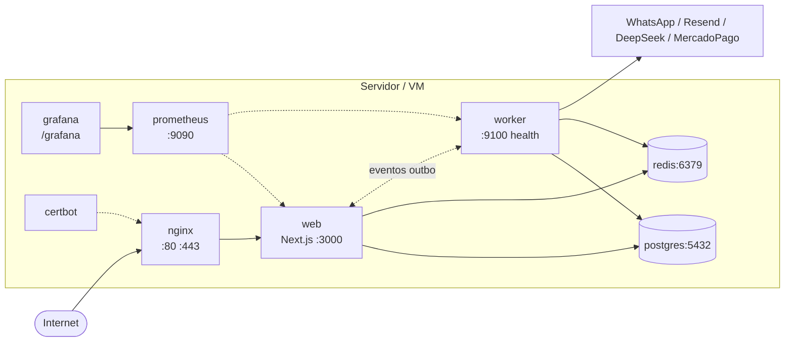

# WBC Platform — Arquitetura de Deploy e Operação

> Documento canônico da topologia de produção. Criado pelo ACH-002 da auditoria de arquitetura (run `2026-04-18_18-17-50`).

## Topologia de Produção



Fonte: `docker-compose.prod.yml` (atual em 2026-04-18).

## Componentes e responsabilidades

| Serviço      | Imagem / Dockerfile                  | Porta                    | Responsabilidade                                                 |
| ------------ | ------------------------------------ | ------------------------ | ---------------------------------------------------------------- |
| `nginx`      | `nginx:alpine` + `deploy/nginx.conf` | 80/443                   | Reverse proxy, TLS via certbot, routing para `web` e `/grafana/` |
| `web`        | `deploy/Dockerfile.web`              | 3000                     | Next.js + tRPC server; SSR + API                                 |
| `worker`     | `deploy/Dockerfile.worker`           | 9100 (health)            | Outbox processor, BullMQ consumers, DLQ scanner                  |
| `postgres`   | `postgres:16-alpine`                 | 5432                     | Banco relacional; persistência primária                          |
| `redis`      | `redis:7-alpine`                     | 6379                     | Cache + filas BullMQ; maxmemory 256mb, LRU                       |
| `prometheus` | `prom/prometheus:latest`             | 9090                     | Métricas; retenção 30d                                           |
| `grafana`    | `grafana/grafana:latest`             | via nginx em `/grafana/` | Dashboards                                                       |
| `certbot`    | `certbot/certbot`                    | —                        | Renovação SSL a cada 12h                                         |

## Conexões e dependências

- **Boot order:** postgres + redis (com healthcheck) → web + worker (depends_on condition: service_healthy) → nginx.
- **Connection pools (Prisma):**
  - `web` → Postgres: `connection_limit=20`, `pool_timeout=10s`.
  - `worker` → Postgres: `connection_limit=5`, `pool_timeout=10s`.
- **Comunicação inter-app:** nenhuma chamada síncrona direta. `web` publica eventos via outbox (Postgres); `worker` consome e processa.
- **Health checks:**
  - `web`: `GET /api/trpc/health.live` (sempre 200 se vivo), `/api/trpc/health.ready` (checa DB, Redis e lag do outbox).
  - `worker`: `GET :9100/health/live` e `/health/ready` (inclui queue depths).

## Graceful shutdown

Implementado no worker (ACH-009):

1. SIGTERM/SIGINT → pausa BullMQ workers (drenando in-flight).
2. Cancela `setInterval` (outbox 5s, cleanup 24h, DLQ 60s).
3. Fecha health server.
4. `.close()` nos workers, `.quit()` no Redis, `.$disconnect()` no Prisma.
5. `exit(0)`. Timeout de segurança 30s (configurável via `WORKER_SHUTDOWN_TIMEOUT_MS`).

Na API, Next.js 15 gerencia shutdown automaticamente em SIGTERM.

## Disaster Recovery (pendente validação humana)

> ⚠️ Esta seção é **placeholder** para validação pelo time. Valores abaixo são sugestões baseadas em MVP; ajustar conforme SLA real acordado com clientes.

| Métrica                        | Valor proposto                                                    | Fonte                           |
| ------------------------------ | ----------------------------------------------------------------- | ------------------------------- |
| RTO (Recovery Time Objective)  | **≤ 4h** (MVP) → `[humano validar]`                               | —                               |
| RPO (Recovery Point Objective) | **≤ 15min** via backup incremental (pg_dump) → `[humano validar]` | `deploy/backup.sh` (se existir) |
| Backup: frequência             | Diário (Postgres), sem backup de Redis (cache descartável)        | `[humano validar]`              |
| Backup: retenção               | 30 dias                                                           | `[humano validar]`              |
| Procedimento de restore        | `pg_restore` em instância nova + redeploy compose                 | `[humano documentar]`           |

## Failover — gatilhos de escalonamento (ACH-009 custos-finops / documentacao-runbooks)

Setup MVP é single-host: 1 VPS com todos os containers; Postgres e Redis locais sem réplica. Isso é **intencionalmente** econômico até atingirmos os gatilhos abaixo. Migração para HA é uma decisão de custo × disponibilidade; cada linha indica a métrica e o alvo arquitetural.

| Gatilho                                                  | Limiar                        | Alvo arquitetural                                           | Prazo para decisão                          |
| -------------------------------------------------------- | ----------------------------- | ----------------------------------------------------------- | ------------------------------------------- |
| **Tenants ativos mensais**                               | > 100                         | Postgres com replica + PgBouncer                            | Planejar quando atingir 80; executar em 100 |
| **Requests p95 em rotas tRPC críticas (sales/schedule)** | > 500ms sustentado por 7 dias | Split `apps/api` como service separado + cache read-through | Quando p95 cruzar 400ms por 3 dias          |
| **Queue depth `wbc:messaging` (média 1h)**               | > 500 waiting                 | Segundo worker replica com `--scale worker=2` (ADR-008)     | Ativar auto-scaling quando cruzar 300       |
| **Postgres CPU p95 em janela de 24h**                    | > 60% sustentado              | Postgres managed (ex.: Supabase/Neon) ou self-hosted HA     | Iniciar POC quando > 50%                    |
| **Redis memory**                                         | > 80% de 256MB                | Aumentar para 512MB; depois Redis Sentinel                  | 75% ⇒ aumento vertical; 90% ⇒ Sentinel      |
| **Disponibilidade mensal observada**                     | < 99.5%                       | Replica Postgres + 2× `web` atrás do nginx                  | Próxima fatura de SLA                       |

### Arquitetura HA alvo (quando múltiplos gatilhos disparam)

```
                       ┌─────────────┐
                       │  CloudFlare │
                       │     CDN     │
                       └──────┬──────┘
                              │
                       ┌──────▼──────┐
                       │ Nginx LB    │
                       │  (active)   │
                       └┬────────────┬┘
                        │            │
                  ┌─────▼─────┐  ┌───▼───────┐
                  │  web #1   │  │  web #2   │
                  └─────┬─────┘  └───┬───────┘
                        │            │
                        ├────────────┤
                        │            │
                  ┌─────▼─────┐  ┌───▼───────┐
                  │ Postgres  │→→│  Postgres │
                  │ (primary) │  │  (replica)│
                  └───────────┘  └───────────┘
                        │
                  ┌─────▼─────┐
                  │   Redis   │
                  │ Sentinel  │
                  └───────────┘
```

### SLOs alinhados (ver `docs/SLO.md` — roadmap)

Os gatilhos acima atendem os SLOs:

- **Disponibilidade:** 99.9% (permite ~43 min downtime/mês).
- **Latência:** p95 < 300ms em rotas tRPC críticas.
- **Outbox lag:** p95 < 30s; p99 < 2 min.
- **RPO:** ≤ 1h (`docs/DR-BACKUP-POLICY.md`).
- **RTO:** ≤ 4h (`docs/runbooks/dr.md`).

Cross-ref: `performance-escalabilidade/ACH-001`, ADR-008 (worker scaling), `docs/architecture/postgres-ha.md`, `docs/architecture/redis-ha.md`.

## Rollback

Padrão: `git revert` do commit problemático + rebuild + redeploy via `deploy/deploy.sh`. Validar com health checks antes de finalizar.

Estratégia **blue/green** considerada no futuro mas não implementada no MVP.

## Variáveis de ambiente críticas

| Variável                                                                 | Usada por       | Descrição                                        |
| ------------------------------------------------------------------------ | --------------- | ------------------------------------------------ |
| `DATABASE_URL`                                                           | web, worker     | Connection string Postgres (inclui pool params)  |
| `REDIS_URL`                                                              | web, worker     | Connection string Redis                          |
| `POSTGRES_PASSWORD`, `REDIS_PASSWORD`                                    | postgres, redis | Secrets                                          |
| `WORKER_SHUTDOWN_TIMEOUT_MS`                                             | worker          | Timeout graceful shutdown (default 30000)        |
| `WORKER_HEALTH_PORT`                                                     | worker          | Porta do health server (default 9100)            |
| `OUTBOX_READY_LAG_THRESHOLD_MS`                                          | web, worker     | Threshold de readiness do outbox (default 60000) |
| `WHATSAPP_MAX_RETRIES`, `WHATSAPP_TIMEOUT_MS`, `WHATSAPP_RETRY_DELAY_MS` | worker          | Override de RetryPolicy (ACH-008)                |
| `DEEPSEEK_MAX_RETRIES`, `DEEPSEEK_TIMEOUT_MS`, `DEEPSEEK_RETRY_DELAY_MS` | worker          | Override de RetryPolicy (ACH-008)                |
| `SENTRY_DSN`                                                             | web, worker     | Error tracking                                   |

## Observabilidade

- **Logs:** Pino (JSON estruturado, stdout) → coletados pelo driver do container.
- **Métricas:** Prometheus scrape em `/metrics` (web via Next.js handler; worker ainda não expõe — pendente).
- **Tracing:** OpenTelemetry (configurado em `packages/shared/` — revisar instrumentação).
- **Errors:** Sentry em `web` e `worker`.
- **Alertas:** `deploy/alerts.yml` carregado pelo Prometheus (revisar SLOs em ADR-007).

## Links

- `docker-compose.prod.yml` — definição da topologia
- `deploy/Dockerfile.web`, `deploy/Dockerfile.worker` — imagens
- `deploy/nginx.conf` — reverse proxy
- `deploy/prometheus.yml`, `deploy/alerts.yml` — observabilidade
- ADR-001 (hexagonal), ADR-002 (multi-tenant), ADR-003 (outbox+BullMQ)
- ACH-002, ACH-009, ACH-011 da auditoria de arquitetura
