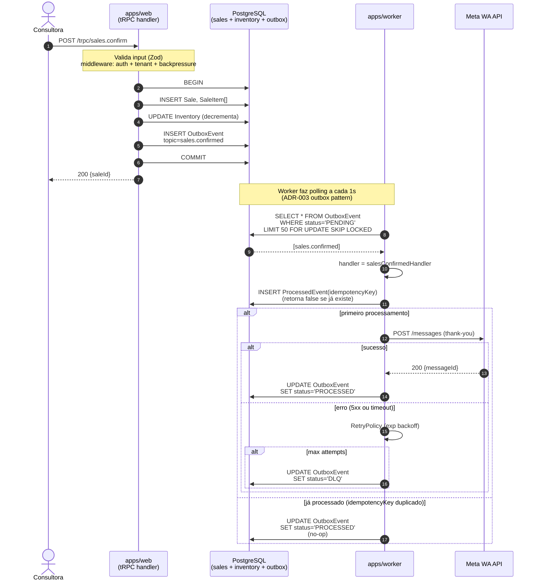
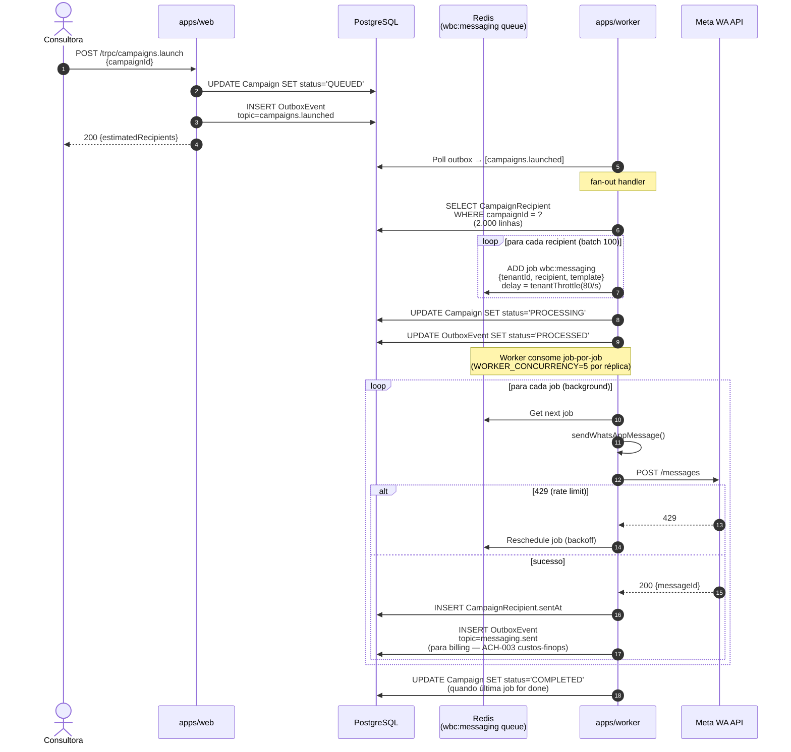
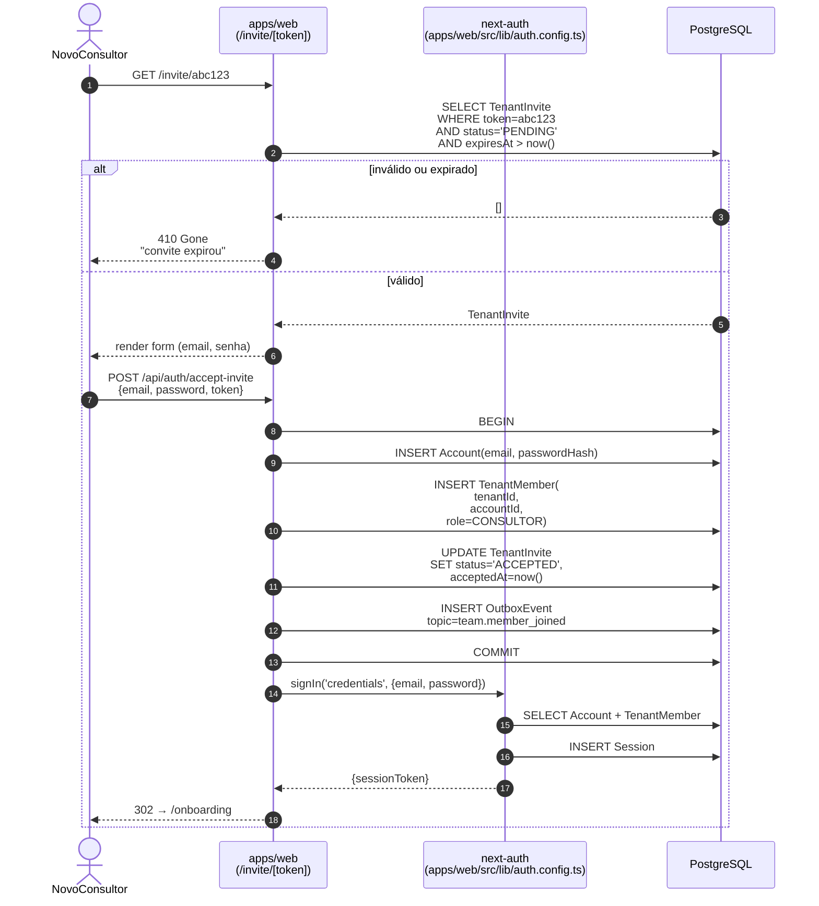

# Fluxos críticos — diagramas de sequência

> Criado pelo ACH-006 da auditoria `documentacao-runbooks/runs/2026-04-19_21-26-25`. Complementa `docs/ARCHITECTURE.md` (estático/containers) e `docs/architecture/events.md` (catálogo de eventos) com diagramas de **sequência em tempo real**.

Cada fluxo mostra:

- **Ator inicial** (consultora, cliente final, sistema).
- **Hops** entre `web`, `api`, Postgres, outbox, `worker`, provider externo.
- **Garantias** (atomicidade, idempotência, retry, fallback).

## Fluxo 1 — Criar venda

Quando a consultora confirma uma venda, a API grava `Sale` + `SaleItem` + decremento de `Inventory` + `OutboxEvent` numa **única transação Postgres**. O worker depois publica notificações sem bloquear a resposta.

**Garantias:**

- **Atomicidade** — sale + inventory + outbox numa transação.
- **Idempotência** — `ProcessedEvent.idempotencyKey` previne double-notification em caso de retry do worker.
- **Back-pressure** — middleware em `sales.confirm` rejeita 503 quando outbox lag > 30s (ACH-006 performance-escalabilidade).
- **Circuit breaker** — chamadas à Meta Cloud API abrem o breaker após 5 falhas consecutivas (ADR-007 + `packages/shared/src/circuit-breaker.ts`).

## Fluxo 2 — Enviar campanha

Consultora dispara "Campanha Dia das Mães" para 2.000 clientes. O sistema não envia 2.000 mensagens síncrono — fan-out via eventos + fila BullMQ com throttle por tenant.

**Garantias:**

- **Throttle por tenant** — não exceder 80 msg/s por tenant (limite Meta).
- **Persistência do progresso** — `CampaignRecipient.sentAt` permite retomar do ponto se o worker reiniciar.
- **Billing observável** — evento `messaging.sent` alimenta `MessageBilled` (ACH-003 custos-finops; pendente).

## Fluxo 3 — Aceitar convite de tenant

Consultora recebe link de convite, cria conta, e entra no workspace. Exige invalidação do token, criação de `Account`, `TenantMember` e `Session` — tudo atômico.

**Garantias:**

- **Atomicidade** — account + tenantMember + invite + outbox numa transação.
- **Não double-join** — `(tenantId, accountId)` é UNIQUE em `TenantMember`.
- **Audit trail** — `team.member_joined` event é consumido por `authAuditLog` handler (ACH-020 seguranca).
- **Idempotência do sign-in** — se o POST for retry (timeout no cliente), a transação falha no `INSERT Account` (email UNIQUE) e o fluxo volta ao form.

## Atualizando estes diagramas

Quando mudanças no fluxo afetarem estes diagramas:

1. Edite o Mermaid diretamente aqui.
2. Rode `pnpm -w exec mermaid-cli -i docs/architecture/flows.md -o /tmp/test.svg` para validar que o diagrama é parseável (opcional local).
3. No PR, inclua screenshot ou link para preview GitHub do Mermaid.
4. Atualize o rodapé desta seção (`Última revisão`).

## Referências

- Overview arquitetural: `docs/ARCHITECTURE.md`.
- Catálogo de eventos: `docs/architecture/events.md`.
- ADRs: `docs/adr/003-outbox-pattern-bullmq.md`, `docs/adr/007-resilience-strategies.md`.
- Achado origem: `Auditoria/documentacao-runbooks/runs/2026-04-19_21-26-25/achados.md#ACH-006`

---

_Última revisão: 2026-04-24 · Próxima revisão esperada: 2026-07-24_
